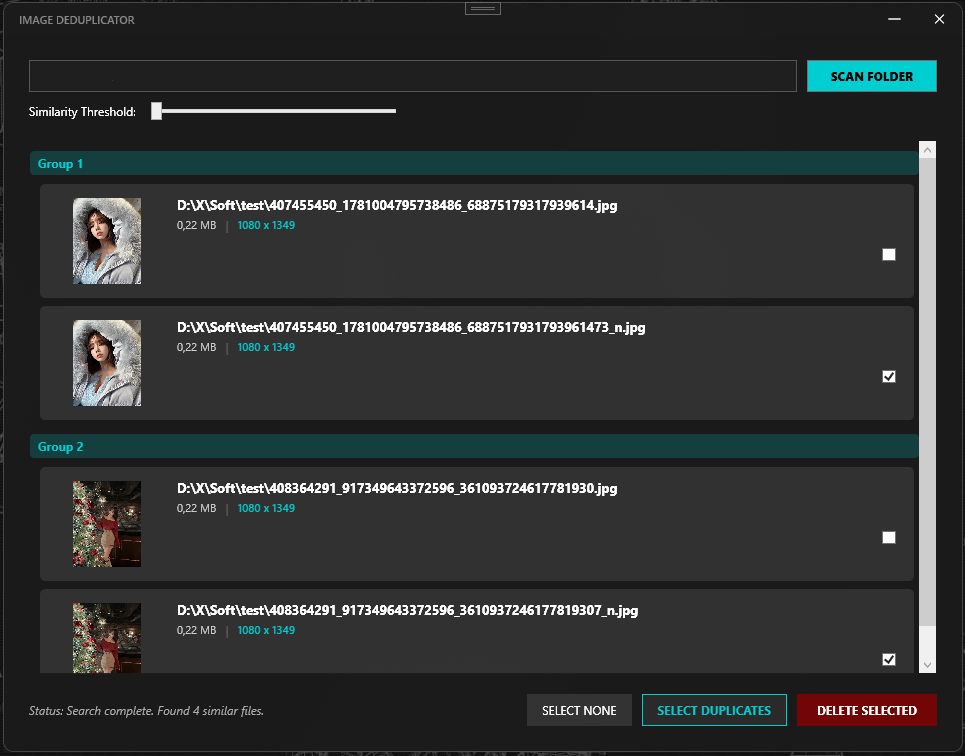

<h3>Image Deduplicator</h3>

With the repost culture and the ever changing storage file names, it has become increasingly difficult to not download duplicate images and I couldn't find a free duplicate image app. This is an app that attempts to find duplicate image by their visual content rather than file similarity. It is written in WPF C# and compiles in Visual Studio Community 2022. Done with the help of AI as I am not a coder.

Select a folder and set the Threshold slider to how strict or lax do you want the similarity algorithm to be (1 and 2 yield the best results). Check the file list manually and select all the duplicate files and send them to the Recycle bin.

Between two similar files, the one with larger dimensions is chosen as original. Double clicking images will open them.
